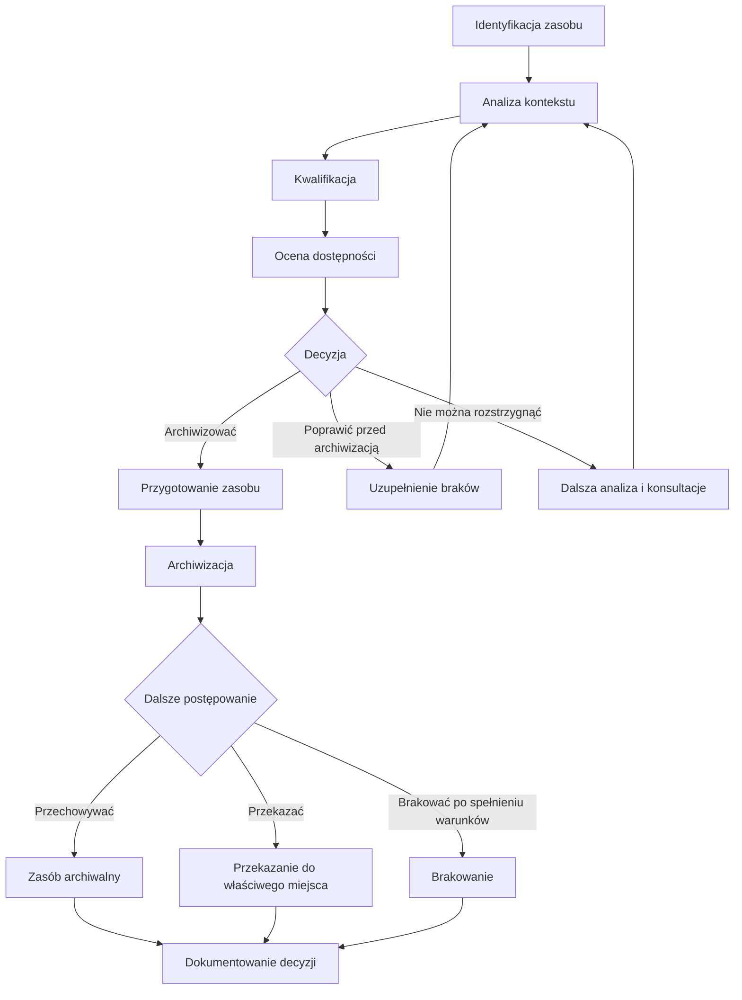

# Schemat procesu archiwizacji

## Cel

Celem schematu jest przedstawienie minimalnego przebiegu archiwizacji zasobu cyfrowego od identyfikacji do archiwizacji, przekazania albo brakowania. Schemat porządkuje kroki opisane w [Procedurze archiwizacji zasobów](./10-procedura-archiwizacji-zasobow.md).

## Schemat

## Opis kroków

1. Identyfikacja zasobu obejmuje nazwę, lokalizację, typ, format, właściciela, URL albo system źródłowy.
2. Analiza kontekstu ustala, czy zasób jest dokumentem sprawy, informacją publiczną, treścią BIP, zasobem projektowym, danymi z systemu albo zasobem historycznym.
3. Kwalifikacja określa klasę JRWA, kategorię archiwalną, okres przechowywania i potrzebę udziału archiwum zakładowego.
4. Ocena dostępności wskazuje, czy zasób może pozostać publiczny, wymaga naprawy, dostępnej wersji albo dostępu alternatywnego.
5. Decyzja rozstrzyga, czy zasób należy archiwizować, poprawić, przekazać, udostępniać na wniosek albo skierować do dalszej analizy.
6. Przygotowanie obejmuje uporządkowanie wersji, metadanych, załączników, formatów, sum kontrolnych i informacji o dalszym dostępie.
7. Archiwizacja oznacza zachowanie zasobu z metadanymi, kontekstem, integralnością i statusem.
8. Przekazanie albo brakowanie może nastąpić wyłącznie zgodnie z kwalifikacją archiwalną i właściwą procedurą.
9. Dokumentowanie decyzji obejmuje rejestr, formularz, protokół albo powiązanie ze sprawą.

## Powiązania

Schemat należy stosować z [Modelem cyklu życia](./06-model-cyklu-zycia.md), [Modelem statusów zasobów](./07-model-statusow-zasobow.md), [Modelem decyzyjnym](./08-model-decyzyjny.md), [Listą kontrolną archiwizacji](./35-lista-kontrolna-archiwizacji.md), [Formularzem decyzji archiwizacyjnej](./38-formularz-decyzji-archiwizacyjnej.md), [Rejestrem decyzji archiwizacyjnych](./40-rejestr-decyzji-archiwizacyjnych.md) i [Procedurą przekazania do archiwum](./15-procedura-przekazania-do-archiwum.md).
