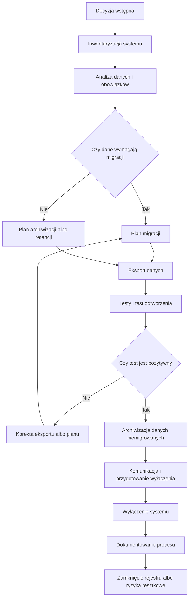

# Schemat procesu wycofania systemu

## Cel

Celem schematu jest przedstawienie minimalnego przebiegu wycofania systemu teleinformatycznego od decyzji wstępnej do udokumentowanego zamknięcia. Schemat rozwija [Procedurę wycofywania systemów](./12-procedura-wycofywania-systemow.md).

## Schemat

## Opis kroków

1. Decyzja wstępna rozpoczyna analizę wycofania, ale nie jest zgodą na wyłączenie systemu.
2. Inwentaryzacja obejmuje dane, dokumenty, metadane, załączniki, multimedia, logi, konfiguracje, konta, integracje i zależności.
3. Analiza danych i obowiązków ustala wymagania JRWA, retencji, informacji publicznej, BIP, RODO, dostępności, bezpieczeństwa i ciągłości działania.
4. Plan migracji określa zakres danych, system docelowy, format eksportu, mapowanie pól, harmonogram, odpowiedzialności i kryteria odbioru.
5. Eksport obejmuje dane, dokumenty, metadane, relacje, historię zmian i elementy potrzebne do odtworzenia kontekstu.
6. Testy i test odtworzenia potwierdzają, że dane można odczytać, wyszukać, powiązać i wykorzystać w systemie docelowym albo repozytorium archiwalnym.
7. Archiwizacja obejmuje dane niemigrowane, dokumentację techniczną, protokoły, decyzje i informacje o dalszym dostępie.
8. Wyłączenie systemu może nastąpić dopiero po spełnieniu warunków blokujących i zatwierdzeniu terminu.
9. Dokumentowanie procesu obejmuje formularz decyzji, rejestr wycofania systemów, protokoły migracji, wyniki testów, komunikację i ryzyka resztkowe.

## Powiązania

Schemat należy stosować z [Procedurą wycofywania systemów](./12-procedura-wycofywania-systemow.md), [Procedurą migracji danych](./13-procedura-migracji-danych.md), [Kryteriami wycofania systemu](./25-kryteria-wycofania-systemu.md), [Dokumentowaniem procesu wycofania](./26-dokumentowanie-procesu-wycofania.md), [Listą kontrolną wycofania systemu](./37-lista-kontrolna-wycofania-systemu.md), [Formularzem decyzji o wycofaniu](./39-formularz-decyzji-o-wycofaniu.md) i [Rejestrem wycofania systemów](./41-rejestr-wycofania-systemow.md).
