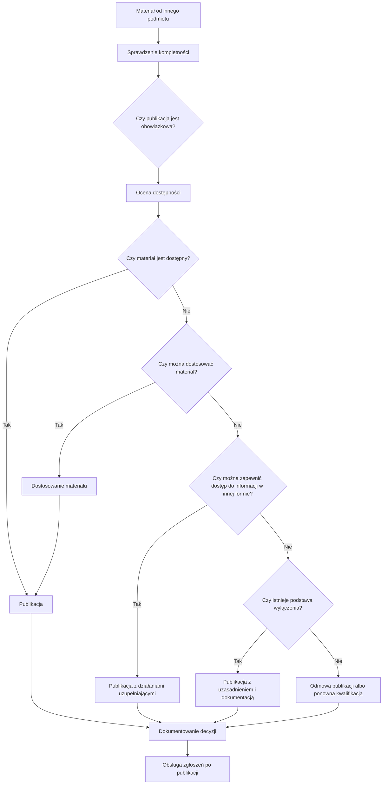

## Charakter materiału

Ten materiał ma charakter wdrożeniowy i wspiera stosowanie zalecenia.

Nie zastępuje oceny prawnej ani indywidualnej decyzji organizacji.

Model A/B/C/D jest pomocniczym modelem operacyjnym, który porządkuje możliwe ścieżki postępowania. Nie zastępuje indywidualnej oceny obowiązku publikacji, możliwości dostosowania materiału, przesłanek wyłączenia oraz obowiązku zapewnienia dostępu do informacji.

## Diagram procesu

## Parametry decyzyjne

1. Co to za materiał?
2. Kto go wytworzył?
3. Czy podmiot publikujący może go zmienić?
4. Czy publikacja jest obowiązkowa?
5. Czy materiał spełnia wymagania dostępności?
6. Czy możliwe jest dostosowanie?
7. Czy można zapewnić dostęp do informacji w inny sposób?
8. Czy istnieją podstawy zastosowania wyłączenia?
9. Jaka decyzja jest uzasadniona?
10. Jak decyzja zostaje udokumentowana?
